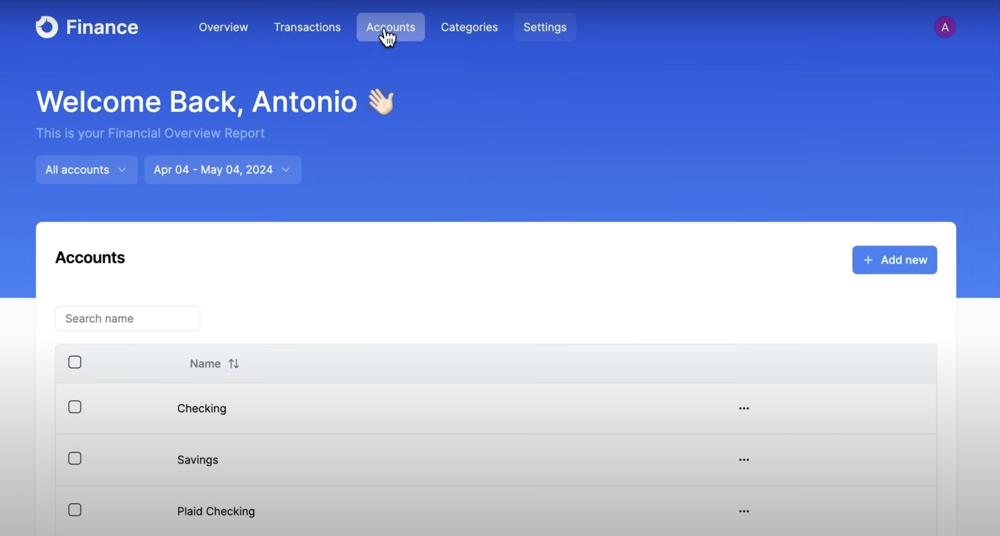

# 💰 Finance SaaS Platform

A modern, full-stack Finance SaaS application built with Next.js 14, React, Hono.js, and TypeScript. It features user authentication via Clerk, database management with Drizzle ORM, and responsive UI styling using Tailwind CSS.

## 📺 Tutorial Reference

This project is based on the tutorial by CodeWithAntonio:
🔗 [Build a Finance SaaS Platform With Next.js, React, Hono.js](https://www.youtube.com/watch?v=N_uNKAus0II)

---

## 🚀 Features

* User authentication and management with Clerk
* RESTful API built with Hono.js
* Database interactions using Drizzle ORM
* Responsive UI with Tailwind CSS
* Type-safe development with TypeScript
* Modular and scalable project structure

---

## 🖼️ Screenshots


 
   
   
   
   


  

For more detailed instructions on adding images to your `README.md`, see this [GeeksforGeeks guide](https://www.geeksforgeeks.org/how-to-add-images-to-readmemd-on-github/).

---

## 🛠️ Technologies Used

* [Next.js 14](https://nextjs.org/)
* [React](https://reactjs.org/)
* [Hono.js](https://hono.dev/)
* [Clerk](https://clerk.dev/)
* [Drizzle ORM](https://orm.drizzle.team/)
* [Tailwind CSS](https://tailwindcss.com/)
* [TypeScript](https://www.typescriptlang.org/)

---

## 📦 Getting Started

### Prerequisites

* Node.js (v18 or later)
* Package manager: npm, yarn, pnpm, or bun

### Installation

1. **Clone the repository:**

   ```bash
   git clone https://github.com/your-username/finance-saas-platform.git
   cd finance-saas-platform
   ```

2. **Install dependencies:**

   ```bash
   npm install
   # or
   yarn install
   # or
   pnpm install
   # or
   bun install
   ```

3. **Configure environment variables:**

   Create a `.env.local` file in the root directory and add the necessary environment variables:

   ```env
   NEXT_PUBLIC_CLERK_PUBLISHABLE_KEY=your_clerk_publishable_key
   CLERK_SECRET_KEY=your_clerk_secret_key
   DATABASE_URL=your_database_url
   ```

4. **Run the development server:**

   ```bash
   npm run dev
   # or
   yarn dev
   # or
   pnpm dev
   # or
   bun dev
   ```

   Open [http://localhost:3000](http://localhost:3000) with your browser to see the result.

---

## 🗂️ Project Structure

```bash
├── app/                # Next.js app directory
├── components/         # Reusable UI components
├── db/                 # Database schema and Drizzle configurations
├── features/           # Feature-specific modules (e.g., accounts)
├── lib/                # Utility functions and libraries
├── public/             # Static assets
├── styles/             # Global styles
├── assets/             # Images and other media assets
├── .env.local          # Environment variables
├── next.config.mjs     # Next.js configuration
├── tailwind.config.ts  # Tailwind CSS configuration
├── tsconfig.json       # TypeScript configuration
└── README.md           # Project documentation
```

---

## 📄 License

This project is licensed under the [MIT License](LICENSE).

---

Feel free to customize this `README.md` to better fit your project's specific details and requirements. If you need assistance with deployment, additional features, or any other aspect, don’t hesitate to ask!
